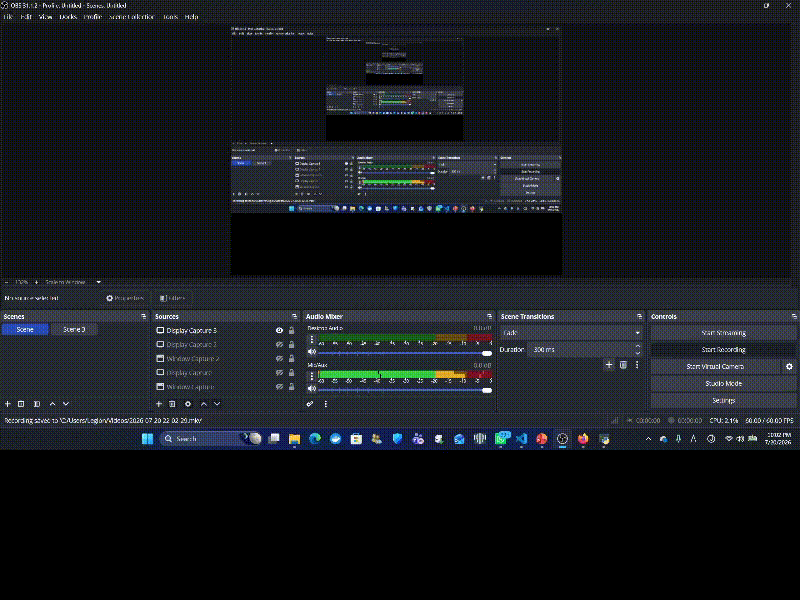

# Real-Time Object Detection and Tracking using YOLOv8 and Deep SORT

## Project Overview

This project implements a **real-time object detection and tracking system** using **OpenCV**, **YOLOv8**, and **Deep SORT**.

The application captures frames from a webcam or a video file, detects multiple objects using the pretrained **YOLOv8** model, and tracks each detected object across consecutive frames using **Deep SORT**. Every tracked object is assigned a unique ID that remains consistent while the object stays visible in the scene.

The output video displays:

- Object bounding boxes
- Object class labels
- Detection confidence scores
- Persistent tracking IDs

This project demonstrates a complete computer vision pipeline, from acquiring video frames to detecting, tracking, and visualizing objects in real time.

---

# Project Architecture

## System Workflow


```
                 Webcam / Video File
                         │
                         ▼
              OpenCV Video Capture
                         │
                         ▼
                  Read Video Frame
                         │
                         ▼
             YOLOv8 Object Detection
       (Bounding Box + Label + Confidence)
                         │
                         ▼
           Prepare Detection Information
                         │
                         ▼
              Deep SORT Tracking
          (Assign Persistent Tracking IDs)
                         │
                         ▼
      Draw Bounding Boxes + Labels + IDs
                         │
                         ▼
             Display Processed Frame
                         │
                    Repeat Until Exit
```

---

# Project Folder Structure

```
ObjectDetectionTracking/
│
├── images/
│   ├── project_architecture.png
│   ├── output.png
│   └── demo.gif
│
├── main.py
├── requirements.txt
└── README.md
```

### Folder Description

| File | Description |
|------|-------------|
| **main.py** | Main application containing the complete detection and tracking pipeline. |
| **requirements.txt** | List of required Python libraries. |
| **README.md** | Project documentation. |
| **images/** | Stores architecture diagrams, screenshots, and demonstration GIFs. |

---

# Real-World Applications

Real-time object detection and tracking are widely used in many intelligent systems, including:

- Smart city surveillance
- Traffic monitoring and vehicle counting
- Security and intrusion detection
- Autonomous driving
- Robotics and automation
- Warehouse inventory monitoring
- Retail customer analytics
- Airport passenger monitoring
- Sports analytics
- Industrial quality inspection

---

# Technologies Used

- Python
- OpenCV
- YOLOv8 (Ultralytics)
- Deep SORT
- NumPy

---

# Code Explanation

## Block 1 — Import Required Libraries

```python
import cv2
from ultralytics import YOLO
from deep_sort_realtime.deepsort_tracker import DeepSort
```

### Purpose

Imports the required libraries.

- **OpenCV** handles video input, visualization, and drawing.
- **YOLOv8** performs object detection.
- **Deep SORT** tracks detected objects and assigns persistent IDs.

---

## Block 2 — Load the YOLO Model

```python
model = YOLO("yolov8n.pt")
```

### Purpose

Loads the pretrained YOLOv8 model.

The model has already been trained on the COCO dataset and can recognize 80 common object categories without additional training.

---

## Block 3 — Initialize the Deep SORT Tracker

```python
tracker = DeepSort(max_age=30)
```

### Purpose

Creates the tracking algorithm.

The tracker:

- Receives detections from YOLO.
- Matches objects across frames.
- Assigns unique IDs.
- Maintains the same ID while the object remains visible.

---

## Block 4 — Open the Video Source

```python
cap = cv2.VideoCapture(0)
```

or

```python
cap = cv2.VideoCapture("video.mp4")
```

### Purpose

Initializes the webcam or opens a stored video file.

---

## Block 5 — Read Frames

```python
while True:
```

Creates the continuous processing loop.

```python
ret, frame = cap.read()
```

Reads one frame from the video source.

---

## Block 6 — Detect Objects

```python
results = model(frame)
```

### Purpose

Runs YOLO inference on the current frame.

YOLO predicts:

- Bounding boxes
- Object labels
- Confidence scores

---

## Block 7 — Prepare Detection List

```python
detections = []
```

Creates a list that stores all detected objects before passing them to the tracker.

---

## Block 8 — Extract Detection Information

```python
for result in results:
    for box in result.boxes:
```

Extracts:

- Bounding box coordinates
- Confidence score
- Object class ID
- Object name

---

## Block 9 — Update the Tracker

```python
tracks = tracker.update_tracks(
    detections,
    frame=frame
)
```

### Purpose

Deep SORT associates new detections with previously tracked objects and maintains unique IDs across frames.

---

## Block 10 — Draw Detection Results

```python
cv2.rectangle(...)
```

Draws bounding boxes.

```python
cv2.putText(...)
```

Displays:

- Object label
- Tracking ID

Example:

```
Person ID:3
Car ID:7
```

---

## Block 11 — Display the Video

```python
cv2.imshow(...)
```

Displays the processed frame with object detection and tracking results.

---

## Block 12 — Exit the Program

```python
if cv2.waitKey(1) & 0xFF == ord('q'):
    break
```

Press **Q** to terminate the application.

---

## Block 13 — Release Resources

```python
cap.release()
cv2.destroyAllWindows()
```

Releases the camera and closes all OpenCV windows.

---

# Installation

## Step 1 — Clone the Repository

Command:

```bash
git clone https://github.com/yourusername/ObjectDetectionTracking.git
```

Purpose:

Downloads the project from GitHub.

---

## Step 2 — Navigate to the Project Folder

Command:

```bash
cd ObjectDetectionTracking
```

Purpose:

Moves into the project directory.

---

## Step 3 — Create a Virtual Environment (Recommended)

Command:

```bash
python -m venv venv
```

Purpose:

Creates an isolated Python environment for the project.

---

## Step 4 — Activate the Virtual Environment

### Windows

Command:

```bash
venv\Scripts\activate
```

Purpose:

Activates the virtual environment.

---

## Step 5 — Install the Required Libraries

Command:

```bash
pip install -r requirements.txt
```

Purpose:

Installs all dependencies listed in `requirements.txt`.

---

# Running the Project

Command:

```bash
python main.py
```

Purpose:

Starts the real-time object detection and tracking application.

---

# Object Detection and Tracking Result

Below is an example of the application's output after detecting and tracking objects in real time.

The following animation shows the real-time object detection and tracking process.




*Figure 3. Real-Time Object Detection and Tracking Demo*

</p>
---

# Expected Output

The application will:

- Capture live video from a webcam or read a video file.
- Detect multiple objects in every frame.
- Draw bounding boxes around detected objects.
- Display object class names.
- Assign persistent tracking IDs.
- Track moving objects continuously.
- Close when the **Q** key is pressed.

---

# Future Improvements

Potential enhancements include:

- Replace Deep SORT with ByteTrack or BoT-SORT.
- Improve detection accuracy using YOLOv8s or YOLOv8m.
- GPU acceleration with CUDA.
- Multi-camera tracking.
- Vehicle and pedestrian counting.
- Speed estimation.
- Region-of-interest monitoring.
- Save processed videos automatically.
- Export tracking statistics to CSV or a database.

---

# Requirements

```
opencv-python
ultralytics
deep-sort-realtime
numpy
```

Install all required packages using:

```bash
pip install -r requirements.txt
```

---

# Author

**Omnia Nabiel**

Artificial Intelligence Internship Project
```
